  <picture>
    <source media="(prefers-color-scheme: light)" srcset="./assets/keelab-hero-light.svg" />
    <source media="(prefers-color-scheme: dark)" srcset="./assets/keelab-hero-dark.svg" />
    
  </picture>

  
  
  

  <strong>Open systems. Explicit boundaries.</strong> 
  Keelab 面向分布式服务与 Agent 系统，围绕运行时、消息执行和发布治理构建可组合基础设施。

<code>intent → contract → runtime → signal → release</code>

  

 

  
<b>01 / Find your starting point</b>

<table>
  <tr>
    <td width="33%" valign="top">
      <a href="https://github.com/keelab/keelith"><strong>keelith</strong></a> 
      Go runtime · lifecycle · DI · transport · governance  
      面向分布式应用、生产导向的 Go 框架与 CLI。先从这里搭起一条可运行、可诊断的服务边界。
    </td>
    <td width="33%" valign="top">
      <a href="https://github.com/keelab/keelmesh"><strong>keelmesh</strong></a> 
      channels · agents · gates · execution loops  
      把消息、媒体、任务治理和执行编排放进清晰的进程边界，提供 HTTP/gRPC 与 Protobuf 接口。
    </td>
    <td width="33%" valign="top">
      <strong>keelway</strong> 
      release governance · Kubernetes-first · coming soon  
      发布治理轨道正在建设中：应用目录、不可变 Release、计划审批、执行、审计与恢复。
    </td>
  </tr>
</table>

  <a href="https://github.com/keelab/contrib"><strong>contrib</strong></a> · 外部基础设施适配 
  <a href="https://github.com/keelab/x"><strong>x</strong></a> · Hertz / Kitex 扩展传输 
  <a href="https://github.com/keelab/operator"><strong>operator</strong></a> · Kubernetes TopologyRevision 控制器 
  <a href="https://github.com/keelab/examples"><strong>examples</strong></a> · 从最小 HTTP 到拓扑控制的渐进示例

  
  

  
<b>02 / Trace the system shape</b>

<pre><code>intent → contract → compose → observe → evolve</code></pre>

Keelab 不把复杂性藏在一层“神奇胶水”里，而是把每个重要边界命名、接线并留下信号：Keelith 承载服务运行时，Keelmesh 连接消息与 Agent，扩展模块把基础设施接入，Keelway 负责把变更变成可审计的发布路径。

<pre><code>If a system boundary matters,
it should be named, observable, and replaceable.</code></pre>

- <strong>Keep business code ordinary.</strong> 业务代码保持普通 Go / Rust；框架能力停在边界上。
- <strong>Make contracts executable.</strong> 让 Proto、Binding、配置和发布意图可以生成、校验、回放。
- <strong>Treat signals as first-class.</strong> 日志、trace、metrics、审计与状态共同描述一次执行。
- <strong>Ship evolution paths.</strong> 交付可渐进启用的运行时、迁移和回滚路径，而不是孤立组件。

  
<b>03 / Run the first service</b>

从 Keelith 开始，几分钟内得到一个可运行的 HTTP 服务：

<pre><code>go install github.com/keelab/keelith/cmd/keelith@latest

keelith new hello
cd hello
go run .
# 另一个终端
curl http://127.0.0.1:8080/ping</code></pre>

接下来按项目目标选择路径：

| 目标 | 入口 |
| --- | --- |
| 构建服务 | <a href="https://github.com/keelab/keelith">keelith</a> 的 <code>new</code>、<code>add</code>、<code>wiring</code>、<code>doctor</code> |
| 连接消息与 Agent | <a href="https://github.com/keelab/keelmesh">keelmesh</a> 的 Channel / Agent / Gate / Loop |
| 接入外部系统 | <a href="https://github.com/keelab/contrib">contrib</a> 的 adapter 与 integration |
| 学习完整组合 | <a href="https://github.com/keelab/examples">examples</a> 的编号示例 |
| 管理 Kubernetes 拓扑 | <a href="https://github.com/keelab/operator">operator</a> 的 <code>TopologyRevision</code> |

  
  

  
<b>04 / Work in the open</b>

Keelab 的公开仓库都优先保持边界清晰、生成物可读、失败可诊断。项目仍在快速演进，升级前请查看各仓库的变更记录与迁移说明。

- <a href="https://github.com/keelab/keelith">Keelith 文档与 API</a>
- <a href="https://github.com/keelab/keelmesh">Keelmesh 文档</a>
- <a href="https://github.com/keelab/examples">Keelab 示例集合</a>
- <a href="https://github.com/keelab/keelith/blob/master/CONTRIBUTING.md">贡献指南</a>
- <a href="https://github.com/keelab/keelith/blob/master/SECURITY.md">安全政策</a>

  

Keelab 是一组开源系统项目；各仓库按项目分别授权，许可证与当前状态以对应仓库页面为准。

  Keelab · build the spine, keep the edge explicit.

